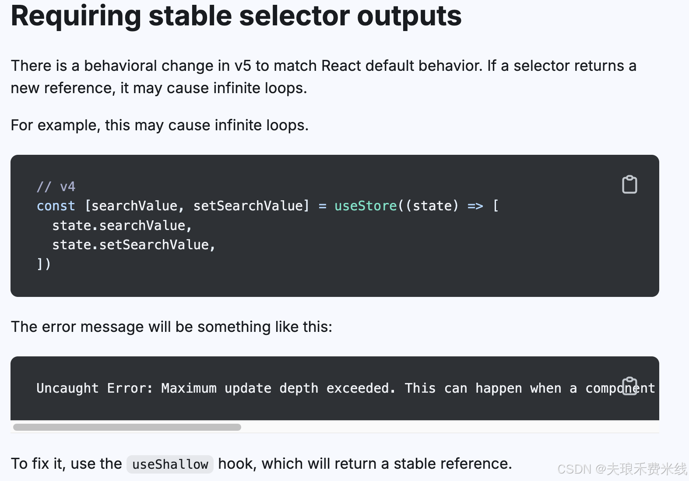

**从Zustand4迁移到Zustand5时，使用选择器方法引入store，出现Maximum update depth exceeded,也就是组件一直重新渲染，改成直接使用store就没有不会出现这个问题**

```js
// const [xIsNext, setXIsNext] = useGameStore((state) => [
//   state.xIsNext,
//   state.setXIsNext,
// ]);
// 出现infinate loop

const { history, setHistory, xIsNext, setXIsNext } = useGameStore()
//没有问题
```

## 问题产生原因

官方文档的解释如下：


[文档链接](https://zustand.docs.pmnd.rs/migrations/migrating-to-v5#requiring-stable-selector-outputs:~:text=There%20is%20a%20behavioral%20change,this%20may%20cause%20infinite%20loops.)

也就是说，这是因为Zustand v5的改动，当selector返回一个新的引用，可能导致无限循环

细究了一下，问题产生原因如下：

1. react的默认比较为引用比较，在zustandV5中沿用了这种方式。
2. 每次重新渲染，useStore都会再执行一次，selector每次都返回的是一个新的引用
3. zustand使用浅比较判断状态变化，触发重新渲染，以此往复

比如像下面这样使用selector

```js
  const { history, setHistory} = useGameStore(((state) => ({
    history: state.history,
    setHistory: state.setHistory,
  })));
  const [searchValue, setSearchValue] = useStore((state)
          => [  state.searchValue,  state.setSearchValue,])
```

以上两种方法selector分别返回一个对象和一个数组，每次重新渲染，其引用都会发生变化，也就触发了infinate loops

## 解决方法

1. 避免在selector中返回对象
   这是我认为最直接的办法：

```js
const history = useGameStore((state) => state.history)
const setHistory = useGameStore((state) => state.setHistory)
//不要像下面这样
//  const { history, setHistory} = useGameStore(((state) => ({
//    history: state.history,
//    setHistory: state.setHistory,
//  })));
```

2. 采用文档中介绍的使用useShllow解决：
   但是useShllow比较对象只会比较最浅层的值，要注意可能产生的副作用

```js
const { history, setHistory, xIsNext, setXIsNext } = useGameStore(
	useShallow((state) => ({
		history: state.history,
		setHistory: state.setHistory,
		xIsNext: state.xIsNext,
		setXIsNext: state.setXIsNext
	}))
)
```

### 附： zustand实现原理

zustand源代码中useShallow实现部分如下(也就是比较值而非比较引用)：

```js
import React from 'react'
import { shallow } from '../vanilla/shallow.ts'

export function useShallow<S, U>(selector: (state: S) => U): (state: S) => U {
  const prev = React.useRef<U>(undefined)
  return (state) => {
    const next = selector(state)
    return shallow(prev.current, next)
      ? (prev.current as U)
      : (prev.current = next)
  }
}
```
